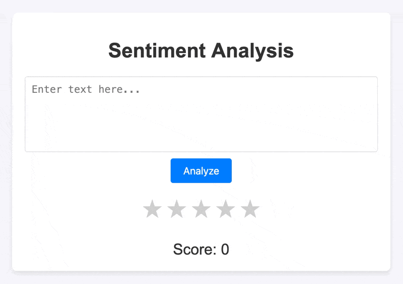

# Simple Sentiment-Analysis: A Step-by-Step Guide 

Interested in learning Natural Language Processing (NLP) and Sentiment Analysis? This repository is designed to guide you through each step, from understanding data to setting up a sentiment analysis model.

We'll begin with data exploration using user reviews of the Netflix app from the Google Play Store, followed by text preprocessing. You'll learn how to clean and prepare text data, explore various text vectorization methods, and compare machine learning models, from logistic regression to advanced transformer models. Finally, we will pick the best model and create a simple website, where users reviews can be rated from 1 to 5.

By the end, you’ll have a clear understanding of sentiment analysis basics and hands-on experience building models. Whether you're new to NLP or just refreshing your skills, this guide offers practical insights with straightforward examples.

    

# Data

## Dataset

The dataset we will use is [`netflix_reviews.csv`](DATASETS/netflix_reviews.ipynb) from [Kaggle](https://www.kaggle.com/datasets/ashishkumarak/netflix-reviews-playstore-daily-updated/data). It contains reviews for the Netflix App in the Google Play Store.

The dataset consists of 8 columns:

| Column Name            | Description                                        |
|------------------------|----------------------------------------------------|
| `reviewId`             | A unique identifier for each review.               |
| `userName`             | The name of the user who submitted the review.     |
| **`content`**              | The actual text of the review.                     |
| **`score`**                | The rating given, ranging from 1 to 5.             |
| `thumbsUpCount`        | The number of "thumbs up" the review received.     |
| `reviewCreatedVersion` | The version of the app used when the review was written. |
| `at`                   | The date and time the review was posted.           |
| `appVersion`           | The version of the app used when the review was written. |

For our analysis we will focus on only two aspects of the reviews. The `content` will be the input to our models and the `score` will be the output.

## Analysis and Visualization

You can get an initial grasp of the dataset here: [`data_visualization.ipynb`](DATA/data_visualization.ipynb). Where we will perform some data analysis and visualization. This step isn't important, but if you want a deeper understanding of the dataset, you can look into it.

## Clean Up

This section outlines the steps to prepare a cleaned dataset. First, we remove unnecessary columns to simplify the dataset. Then, we drop duplicate rows and any rows with missing values.

You can see all these steps in: [`data_cleanup.ipynb`](DATA/data_cleanup.ipynb).

We then save the cleaned up dataset as: [`cleaned_data.csv`](DATASETS/cleaned_data.csv).

# Text

At this point, we need to look at the `content` of the review. This is because it often contains unwanted characters, such as punctuation, emoticons, and repeated characters. To address this, we first **pre-process** the text to clean it up. We then convert the words to numbers through a process called text **vectorization**. This is because our models work with numerical data, not text.

## Text Pre-Processing

The text pre-processing is done in: [`text_preprocessing.ipynb`](TEXT/text_preprocessing.ipynb).

The pre-processing goes as follows:
- We load the cleaned dataset: [`cleaned_data.csv`](DATA/cleaned_data.csv).
- We clean up the text using several techniques (turn the text into lowercase, replace emoticons, remove repeated characters) to make it ready for vectorization.

The pre-processed dataset is saved as: [`preprocessed_text.csv`](DATASETS/preprocessed_text.csv).

## Text Vectorization

At this point, we are ready to turn our words into numbers. There are many ways to do this. The ones we have explored in this repository are:
- BoW (Bag of Words): [`bagofwords.ipynb`](TEXT/bagofwords.ipynb)
- TF-IDF (Term Frequency - Inverse Document Frequency): [`tfidf.ipynb`](TEXT/tfidf.ipynb)
- Word2Vec (Word 2 Vector): [`word2vec.ipynb`](TEXT/word2vec.ipynb)
- GloVe (Global Vectors): [`glove.ipynb`](TEXT/glove.ipynb)

We will give you some general guidelines on which one to choose, and the pros and cons of each.

### A note on how to deal with Out-Of-Vocabulary (OOV) Words

Out-of-vocabulary (OOV) words are any terms that aren't in the model's predefined vocabulary. They're usually words the model hasn't seen in the training data, which can make it tricky to understand or process new inputs.

There are two main ways to manage OOV words:

- In a **closed vocabulary** approach, all words in the training and test sets are predefined. Any word outside the known vocabulary is either discarded or raises an error, depending on the language model settings.
- In the **open vocabulary** approach, the model uses a special symbol, <UNK> (unknown token), to handle OOV words. Both the training set and the test set map any unknown word to <UNK> so the model can process new or rare words without errors.

For this project, we’re following a closed vocabulary approach and will ignore any words that aren't in the vocabulary.

# Picking a Model

At this point we have different ways to deal with the text vectorization and many different models we can pick. So we have a lot of possible combinations - for this project, we will give you some possible models so you can see how you can combine different text vectorization techniques and different models.

- Linear Regression + BoW: [`linear_regression.ipynb`](MODELS/Linear_Regression/Linear_Regression.ipynb)
- Support Vector Regression + TF-IDF : [`SVR.ipynb`](MODELS/SVR/SVR.ipynb)
- Random Forest Regression + Word2Vec CBoW : [`random_forest.ipynb`](MODELS/Random_Forest/random_forest.ipynb)
- XGBoost Regression + GloVe Twitter : [`xgboost.ipynb`](MODELS/XGBoost/xgboost.ipynb)  
- Transformer Regression : [`transformer.ipynb`](MODELS/Transformer/transformer.ipynb)
  
### A note on Regression vs. Classification

To predict the sentiment of a review, you can choose between a **classification** or a **regression** approach. For example, we can classify sentiment into categories such as positive, neutral, or negative (classification), or we can predict a continuous score, such as a rating between 0 and 5 (regression). Each approach is valid, but with different implications.

For this project, we chose regression. One reason is that a classification model treats errors independently; if the model predicts a 5-star review as a 1-star, it counts it as "wrong" without capturing the degree of error. In contrast, regression captures this nuance: predicting a 5 when the actual label is 1 results in a larger error (e.g., 5-1 = 4) in the loss function. This way, we can measure not only whether the prediction is correct or incorrect, but also how far off it is, allowing for a more detailed assessment of model performance.

# Website

Finally, we create a basic website, where reviews can be rated from 1 to 5. The app utilizes the transformer model, since it was the one that gave the best performance. The code for the app can be found here: [`app.py`](WEBSITE/app.py). The website is accessible in this link: **PLACEHOLDER**  ehehxd

Here's how the website works:

    

